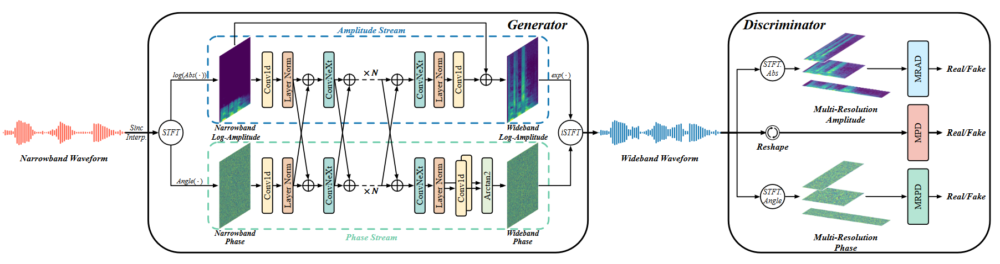

# Towards High-Quality and Efficient Speech Bandwidth Extension with Parallel Amplitude and Phase Prediction
This is the unofficial implementation of [Towards High-Quality and Efficient Speech Bandwidth Extension with Parallel Amplitude and Phase Prediction](https://arxiv.org/abs/2401.06387). 



## Training:

First prepare data: You need to convert the VCTK dataset to WAV format and truncate the head and tail silence segments. You can refer to the file pres/data_pre.py

To train this model, run this code:

```
python train.py --gpu_avail [gpu_ids] --batch_size [batch] --init_lr [initial learning rate] --epochs [number of epochs of training] or --steps [number of steps where training stops] --data_dir [dir of VCTK dataset]
```
or you may change default options in train.py

To run inference or evaluation steps，you can refer to the file evaluation.py


## Notes:
* refercode folder contains reference code from https://github.com/jik876/hifi-gan & https://github.com/facebookresearch/ConvNeXt & https://github.com/huyanxin/phasen
* runs folder contains tensorboard logs
* AudioSamples folder contains samples for comparison, including spectra

## Citations:
```
@article{lu2024towards,
  title={Towards high-quality and efficient speech bandwidth extension with parallel amplitude and phase prediction},
  author={Lu, Ye-Xin and Ai, Yang and Du, Hui-Peng and Ling, Zhen-Hua},
  journal={arXiv preprint arXiv:2401.06387},
  year={2024}
}

```

